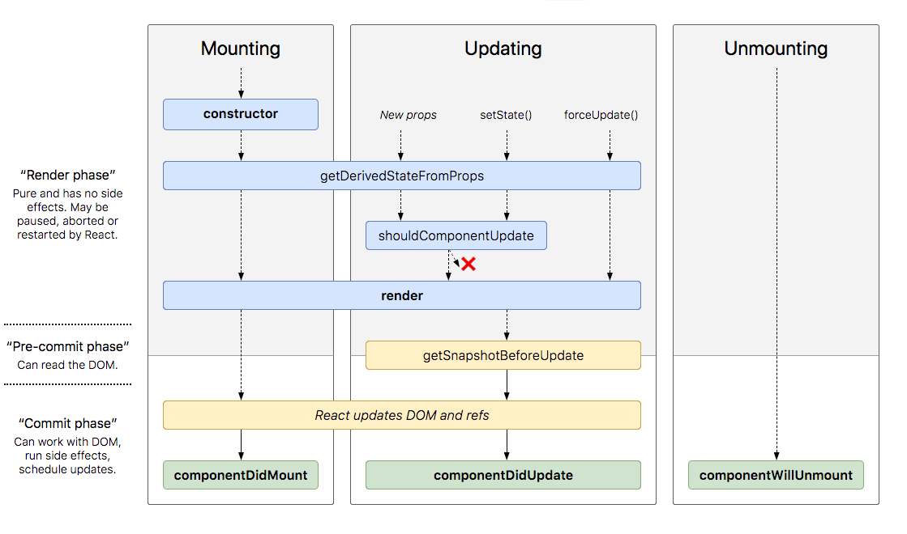

# Estado y Ciclo de vida

Índice

1. ¿Qué son los estados?

2. ¿En qué situación puedo utilizar los estados?

3. API de estados de un componente

4. Ejemplos de estados en componentes

## 1. ¿Qué son los estados?

Los estados son datos mutables del componente. Las propiedades y los estados son ambos atributos de una clase, pero tienen propósitos diferentes: mientras las propiedades son inmutables, los valores de los estados pueden cambiar.

Por un lado, los estados actúan en el contexto del componente, y por otro, las propiedades crean una instancia del componente cuando le pasas un nuevo valor desde un componente padre.

## 2. ¿En qué situación puedo utilizar los estados?

Las propiedades te permiten tener diferentes vistas poniendo el mismo componente un número de veces con diferentes propiedades. Pero estas no permiten cambiar los datos de una vista ya renderizada, para eso se utilizan los estados.

Un ejemplo claro es el componente de reloj, en que necesitas actualizar periódicamente la vista con los segundos.


## 3. API de estados de un componente

### **Acceder a los estados y valores**

this.state.<nombre_estado>

```jsx
this.state.name;
```

### **Establecer los valores iniciales**

En el constructor del componente:

```jsx
constructor() {
    this.state = { name: "pepe" };
}
```

o con el nuevo Hook useState:

```jsx
const [count, setCount] = useState(0);
```

- useState(<initial_value>): valor inicial del estado

- count: variable del estado

- setCount: función que nos permite modificar el estado (igual a setState)

### **Actualizar los estados**

this.setState((state, props) => {});

- state: estado previo
- props: valor de props en el momento en que se aplica la actualización.

```jsx
this.setState({
    date: new Date()
});
```

- Este método es asíncrono
- El método actualiza solamente el estado que quires. No actualiza todo el objeto. Por ejemplo, si en un objeto tienes diferentes estados, como el nombre, apellido, edad y solamente quieres actualizar la edad, lo único que tienes que hacer es algo como this.setState({edad:24}); Los demás valores quedarán igual.


## 4. Métodos del Ciclo de vida de un componente

